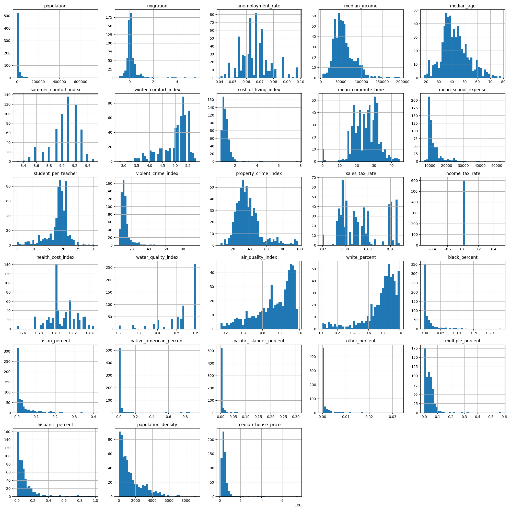
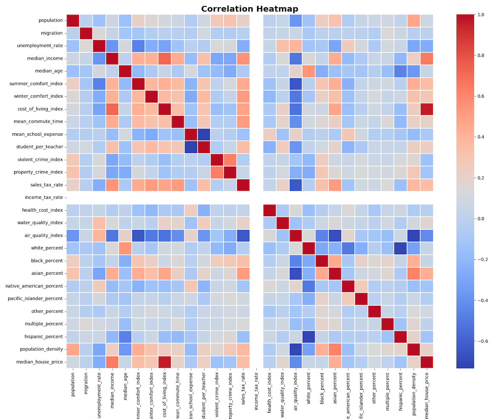
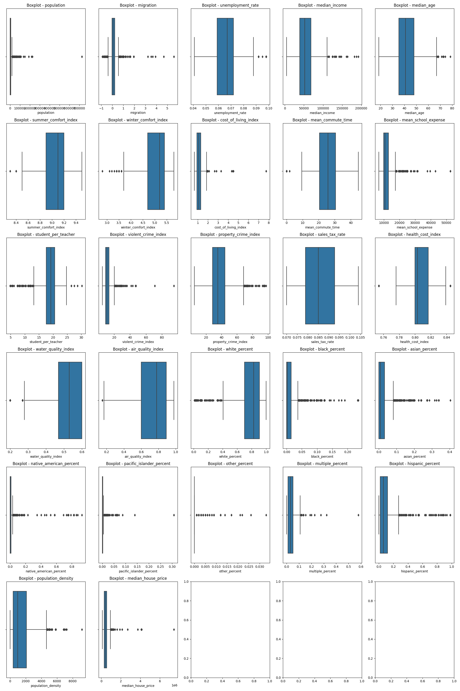

# Washington State Housing Price Predictor

## Table of Content
1. [Description](#description)
2. [Data Collection](#data-collection)
3. [Exploratory Data Analysis](#exploratory-data-analysis)
4. [Outlier Detection](#outlier-detection)
5. [Data Scaling](#data-scaling)
6. [Feature Selection](#feature-selection)
7. [Data Splitting](#data-splitting)
8. [Model Selection](#model-selection)
9. [Model Training](#model-training)
10. [Final Testing Result](#final-testing-result)

## Description
This project applies various machine learning models, such as Elastic-Net regression, support vector regression, Kernel SVR, Decision tree, random forests, KNN, and gradient boost to predict median house prices in Washington State. Through a comprehensive process that includes data scraping, preprocessing, model tuning, and evaluation, the project provides insights into the housing market and offers a tool for house price estimation.

## Data Collection
The data collection phase employed web scraping techniques to gather data from various open-source statistic websites and real estate platforms. The resulting data set comprised data from 621 cities, each represented by 28 features and one target value. To scrape the data set, please run the following command or run the file  "web_crawler.py".


```commandline
python3 web_crawler.py
```

## Exploratory Data Analysis

To start the following process, please run the following command or run the file  "house_price_prediction.py".


```commandline
python3 house_price_prediction.py
```

During the analysis, it shows strong links between the cost of living and median house prices in Washington. On the other hand, there was no connection with the income tax rate since it's the same across all cities in the state. Specifically, the median house price tends to rise with the cost of living and median income, while it tends to decrease with an increase in the unemployment rate and air quality index.



## Outlier Detection


Outlier detection was done to look for obvious mistakes in the features, such as negative values or percentages greater than one. Without specific knowledge about the distribution of some features, the focus was mainly on checking for these clear errors. After examining everything, no noticeable incorrect values were found.



## Data Scaling

Standardization was used instead of normalization to handle the different ranges of features, some of which were from 0 to 1, and others with wider or unlimited ranges. This made it easier to manage outliers and compare these features on the same scale.

## Feature Selection

The dataset had some features that might overlap, causing multicollinearity. Lasso regression was used to solve this problem and pick the important features. Instead of specifying how many features to select, Lasso chose 20 on its own. The cost of living index was the strongest predictor, while others, like the summer comfort index and median income, were reduced to zero, meaning they weren't as important. This happened even if some had a strong connection to the house price because Lasso considers how features interact.

## Data Splitting

The data was mixed up randomly to avoid any biases from its original order. It was then split into two parts: 80% for training the models and fine-tuning them, and 20% for testing. The test set allowed us to see how well the models could predict values they hadn't seen before.

## Model Selection

The primary objective of this project was to compare and evaluate the performance of various machine learning models in predicting house prices. The models chosen spanned a wide range of techniques, including Linear Regression, Support Vector Regression (SVR), Kernel SVR, Decision Tree, Random Forest, K-Nearest Neighbor, Gradient Boosting, and Elastic Net Regression.

## Model Training
Each model was not only trained individually but also fine-tuned using hyperparameters to make it perform better. Grid Search with 5-fold cross-validation was used to find the best settings for each model, using a score called R2 to pick the best ones. A higher R2 score means the model fits the actual data better. The results for each finely-tuned model, showing their settings and how well they did, are listed below:

### Linear Regression
- **Coefficient**: 
  - `[ -5679.3958, 13154.6540, 13437.791, 1197.8018, 2454.7614, 486445.4295, -41589.7839, -7052.0989, 1880.9447, 8088.3229, -32181.9551, 13220.4247, -22527.9174, 27499.9030, -2774.3122, 6046.5736, -3113.0952, -914.7775, 6713.8521, 18578.0844]`
  - cost of living demonstrates a dominant coefficient value of `486,445`.
  - The coefficients allow a 95% prediction of the median house price through a linear combination of the features.
- **R-squared Score**: 0.9552

### Support Vector Regression (SVR)
- **Parameters**:
  - `C = 10000000`: Regularization parameter; large value means lower regularization and the model will fit the training data more accurately, potentially leading to overfitting.
- **R-squared Score**: 0.8906

### Kernel Support Vector Regression (Kernel SVR)
- **Parameters**:
  - `C = 1000000`: Regularization parameter.
  - `gamma = 0.01`: Kernel coefficient; low values will create a more flexible decision boundary.
  - `kernel = "rbf"`: Radial Basis Function kernel; it allows the model to create nonlinear decision boundaries.
- **R-squared Score**: 0.9045

### Decision Tree
- **Parameters**:
  - `criterion = "absolute_error"`: The function to measure the quality of a split. 'absolute_error' minimizes the L1 loss or absolute differences between actual and predicted values.
  - `max_depth = 40`: The maximum depth of the tree; deep trees can fit the data well but may also lead to overfitting.
  - `min_samples_leaf = 4`: Minimum number of samples required to be at a leaf node; higher values prevent creating leaves with fewer samples, making the tree more robust.
  - `min_samples_split = 20`: Minimum number of samples required to split an internal node; higher values will create a more generalized tree.
  - `splitter = 'best'`: The strategy used to choose the split at each node. 'best' means that the algorithm will choose the best split among all possible splits at each node.
- **R-squared Score**: 0.9074

### Random Forest
- **Parameters**:
  - `min_samples_leaf = 4`: Minimum number of samples required to be at a leaf node.
  - `min_samples_split = 25`: Minimum number of samples required to split an internal node.
  - `n_estimators = 300`: Number of trees in the forest.
- **R-squared Score**: 0.9032

### K-Nearest Neighbors
- **Parameters**:
  - `leaf_size = 10`: The size of leaves in the KD-Tree.
  - `n_neighbors = 3`: Number of neighbors to use.
  - `weights = 'distance'`: Weight function used in prediction; 'distance' means closer neighbors have a greater influence.
- **R-squared Score**: 0.8913

### Gradient Boosting
- **Parameters**:
  - `learning_rate = 0.1`: Learning rate that shrinks the contribution of each tree.
  - `max_depth = 3`: Maximum depth of the individual estimators.
  - `n_estimators = 100`: Number of boosting stages to be performed.
  - `subsample = 0.8`: Fraction of samples used for fitting the individual base learners.
- **R-squared Score**: 0.9319

### Elastic-Net Regression
- **Parameters**:
  - `alpha = 0.01`: Constant that multiplies the penalty terms.
  - `l1_ratio = 0.2`: Mixing parameter for the penalty; 0 for L2 penalty, 1 for L1 penalty.
- **R-squared Score**: 0.9276


The models used worked well, especially Linear Regression, which had the best score. A factor like the cost of living was very important in predicting prices. Adjusting certain settings in some models helped them do better. All in all, making careful adjustments to each model was key to their success.

## Final Testing Result


| Model                   | MAE   | MSE          | RMSE   | $R^2$  | Adjusted $R^2$ |
|-------------------------|-------|--------------|--------|--------|----------------|
| Linear Regression       | 66303 | 11420168866  | 106865 | 0.9271 | 0.9125         |
| SVR                     | 95086 | 17136819529  | 130907 | 0.8906 | 0.8687         |
| Kernel SVR              | 72561 | 14960976724  | 122315 | 0.9045 | 0.8854         |
| Decision Tree           | 76729 | 14496453388  | 120401 | 0.9074 | 0.8889         |
| Random Forest           | 74687 | 15162928400  | 123137 | 0.9032 | 0.8838         |
| K-Nearest Neighbors     | 93669 | 17027901076  | 130490 | 0.8913 | 0.8695         |
| Gradient Boosting       | 71151 | 10351330617  | 101741 | 0.9339 | 0.9207         |
| Elastic-Net Regression  | 66333 | 11334402052  | 106463 | 0.9276 | 0.9131         |

*(Some metrics values have been rounded to integer)*

- **All models** have strong predictive performance with adjusted R² values above 0.88, largely influenced by the "cost of living index" feature.
- **Models Ranked**
  1. **Gradient Boosting**
  2. **Linear Regression & Elastic-Net Regression**, second-best performance; preferred if interpretability is essential.
  3. **Random Forest & Kernel SVR** 
  4. **Decision Tree**
  5. **K-Nearest Neighbors & Support Vector Regression (SVR)**, least effective but still have good prediction ability.
